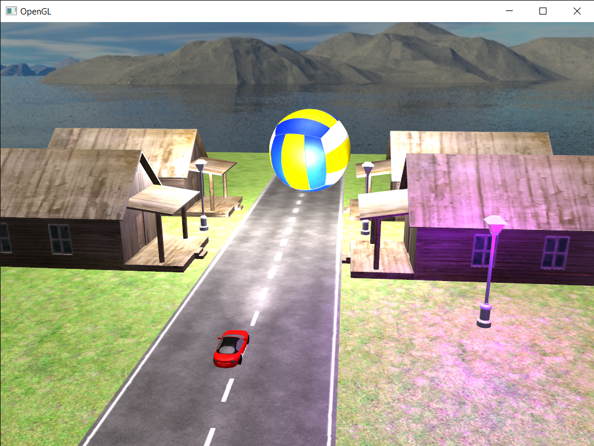
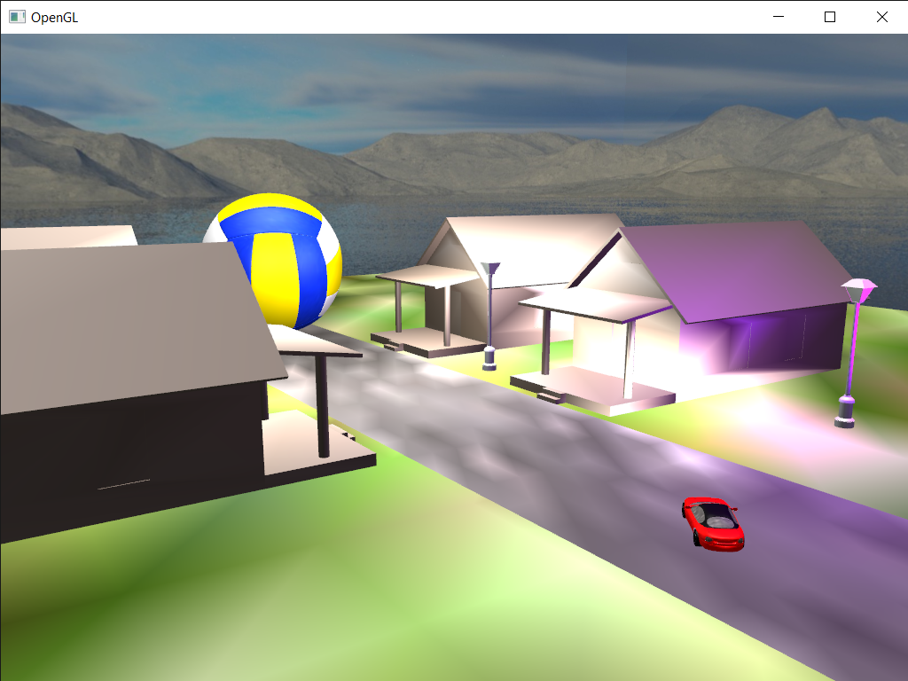
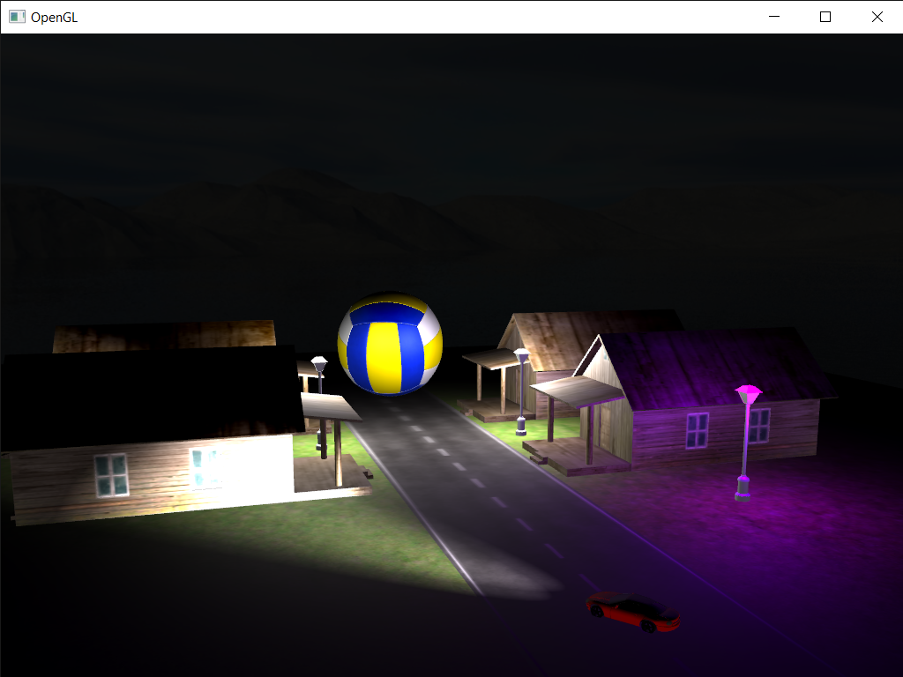
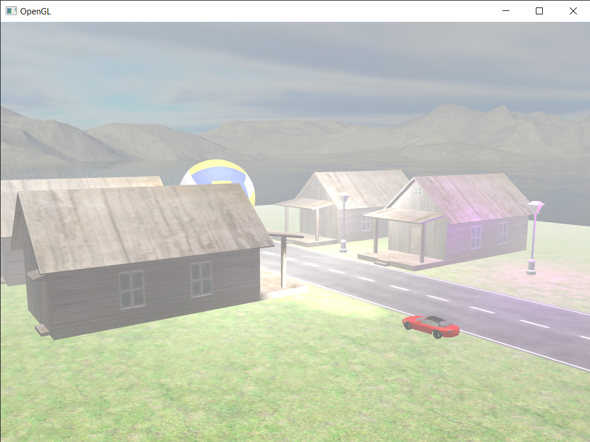

# OpenGL-project

## Project description
In this project i used three methods to calculate light and fog.\
The first method of light computation which i used is **Phong Shading** which gives realistics efects thanks to computation of the color of every pixel. The second method is **Gouraud Shading**. It is much faster than Phong Shading but it has it's drawbacks - it's nowhere near realism. The efect is caused by computing light, only in the vertices of the mesh triangles. Computed color is then interpolated to other pixels of the triangle, based on their position.

The last method of shading i used is **Deffered Shading**. This method is as realistic as Phong Shading but needs less time to compute thanks to three buffers used to compute color of every pixel. In Phong Shading color of every pixel is computed and then rederred to the screen which may cause overwriting old color (because currently rendered object is closer to the camera than the object that was renderred previously). Deffered Shading eliminates this problem by using one pair of shaders (vertex- and fragmentshader), to compute buffers containing informations about pixels colors, and a second pair od sahders to renderr each pixel. Thanks to that each pixel is renderred only once which saves a lot of time.

Fog density depends on the distance between camera and point inthe scene - the farther the camera is from the point the more dense the fog is. In the project I used [exponential fog](https://www.opengl.org/archives/resources/code/samples/advanced/advanced97/notes/node122.html "exponential fog"). 

## Project functionalities
Project uses keybindig for changing the settings. Below you can find description of keys and corresponding options. 

### Moving the car
To move the car use: W, S, A, D.

### Use Phong Shading
To activate **P**hong Shading click **P**.

### Use Gouraud Shading
To activate **G**ouraud Shading click **G**.

### Use Deffered Shading
To activate/deactivate Deffered Shading click B.

**Warning** To use other methods of shading, first you need to deactivate Deffered Shading.

**Warning** To spot the difference between activated and deactivated Deffered Shading, first activate Gouraud Shading and then Deffered Shading (Phong Shading is as reaalistic as Deffered Shading and you won't notice the difference between them). 

### Fog
To turn on//off **F**og click **F**.

### Time cycle
To turn on/off **T**ime cycle click **T**.
Turning the time cycle off means it will be stopped exactly in the moment you clicked the button (daylight won't change anymore so for example it will be night as long as you don't turn the time cycle on).

**Warning** It make take some time to notice the change of daylight.

## Cameras
In the project I inluded four types of cameras (number in the list is also the key which corresponds to the camera).
1. Default camera is "free" which means using the mouse and arrows its position can be changed.
2. Stationary camera stands still and looks all the time to hardcoded point of the scene.
3. Camera bounded with car - camera is alwyas behind the car looking in the direction in which car drives.
4. Tracking camera always look on the car - camera stands still in hardcoded position but always turn to the car.

## Sample screenshots
### Default scene

### Gouraud Shading

### Day/night cycle

### Fog on

## References
The project uses the following dlls:
* [ASSIMP](https://www.assimp.org/)
* [GLEW](http://glew.sourceforge.net/)
* [GLFW](https://www.glfw.org/)
* [GLM](https://github.com/g-truc/glm)

Also the project was made based on the https://learnopengl.com/ tutorial and http://www.opengl-tutorial.org/ so it contains some code from both of these tutorials.
